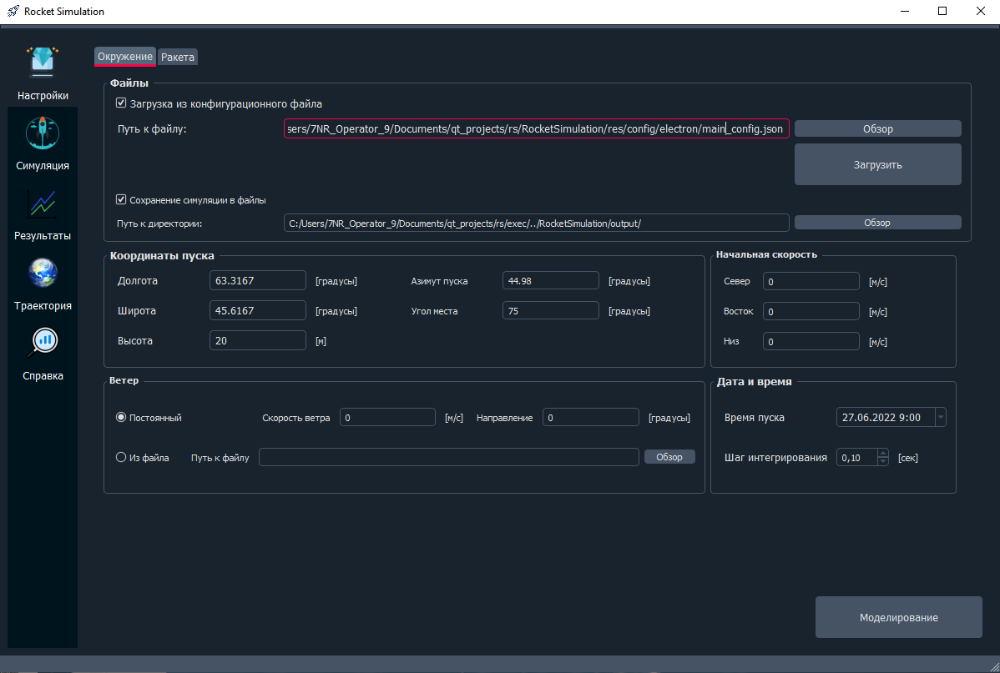

# RocketSimulation
 
## Описание
Программный продукт предназначен для моделирования полёта ракеты-носителя, предназначенной для вывода полезной нагрузки с возможностью спасения 1-ой ступени парашютным способом. Поддерживаются различные события, которые могут быть сгенерированы в любое время во время расчёта: отключение двигателя, разделение ступеней, сброс обтекателя, срабатывание парашюта. Расчёт производится на основе задаваемых пользователем исходных данных о ракете-носителе и окружающей среде. Имеется возможность задавать многоступенчатую ракету-носитель. Программа является независимой от типа двигателя и может проводить расчёты как на жидкостных, твёрдотопливных, так и на гибридных ракетах. Результаты вычислений выводятся в двух видах: текстовые файлы формата csv
 и отображение в программном комплексе. В программе предусмотрено табличное и графическое отображение результатов моделирования

 ## Документация
 [Описание программы и инструкция пользователя](res/doc/)
 
 ## Изображения
  [Скриншоты программы](res/images/)
 ### Главное окно
 